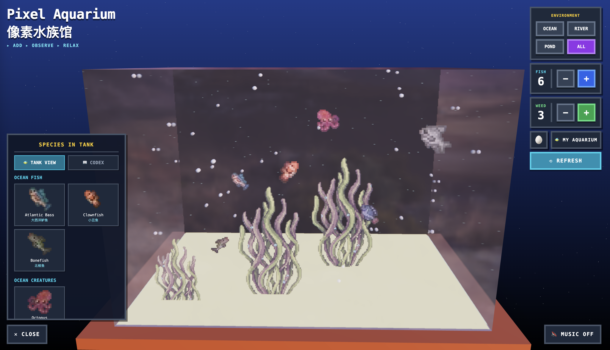
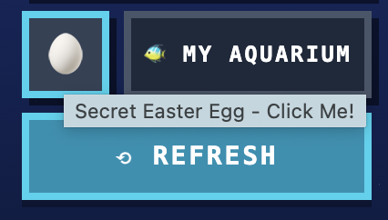

# 像素水族馆 Pixel Aquarium

A tranquil 3D aquarium experience where pixel-art marine life swims gracefully in a realistic glass tank. Built with **React Three Fiber** and **Three.js**, this interactive aquarium brings the soothing vibes of fishkeeping to your browser!

[https://woody-lin-3d-pixel-aquarium.vercel.app/](https://woody-lin-3d-pixel-aquarium.vercel.app/)

## Interactive Controls

- **Add/Remove Fish** - Build your **own aquarium** (up to 30 fish~ use LocalStorage to persist fish between sessions!)
- **Seaweed Decoration** - Customize your tank with animated seaweed
- **Environment Selection** - Choose from Ocean, River, Pond, or All species
- **Orbit Controls** - Rotate and zoom to admire your aquatic friends from any angle

## 🐟 Massive Fish Database

Over **100+ species** across multiple categories:

- Ocean Fish - From Clownfish to Anglerfish
- Ocean Creatures - Jellyfish, Octopus, Sea Turtles and more
- River Fish - Bass, Salmon, Piranha, and friends
- Pond Fish - Goldfish, Koi, and decorative varieties
- Freshwater Creatures - Frogs, Axolotls, Crayfish, and more

## Special Features

- Fish Identifier - Click to view all species in your tank (with English & Chinese names!)
- Fish Codex - Browse all available species and see which ones are currently swimming in your tank
- My Aquarium - Save your custom tank configuration and load it anytime
- Lofi Music - Toggle relaxing background music to enhance the zen vibes
- Realistic Physics - Fish swim naturally with gentle bobbing and wall-bouncing behavior
- Glass Material - Stunning transmission shader for that authentic aquarium look
- Discover the secret easter egg... 🥚✨ and more!

## Technical Highlights

- React Three Fiber for declarative 3D rendering
- Pixel-Perfect Sprites with nearest-neighbor filtering
- Dynamic Lighting with shadows and reflections
- Responsive Design - Works on desktop and mobile
- LocalStorage Integration - Your aquarium persists between sessions
- Smooth Animations - Seaweed sways, bubbles rise, fish swim naturally

## Credits

For the fish sprites, I bought them from [shubibubi](https://itch.io/profile/shubibubi) on [itch.io](https://itch.io/).

For the Lofi Music, I got it from [XtremeFreddy](https://pixabay.com/users/xtremefreddy-32332307/) on [Pixabay](https://pixabay.com/) under the license.
